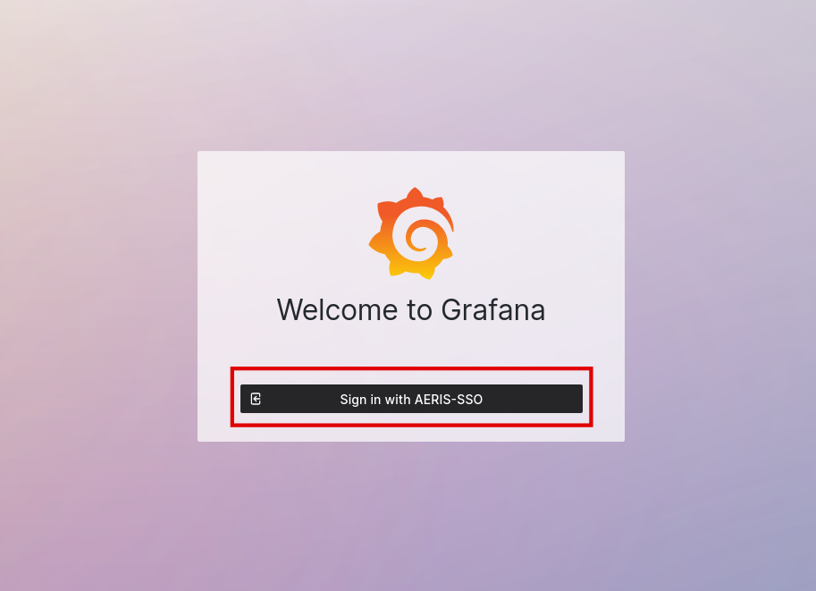

# Grafana

ACTRIS-CCRES provides acces to a grafana server to visualize in near real time HouseKeeping Date (HKD) of instruments.

The server is available at [https://ccres.ipsl.fr/grafana/](https://ccres.ipsl.fr/grafana/).

## First connection

1. Go to [https://ccres.ipsl.fr/grafana/](https://ccres.ipsl.fr/grafana/)
2. Click on the `Sign in with AERIS-SSO` button

    {width=500 align=center}

3. You will be redirected on the AERIS-SSO login page