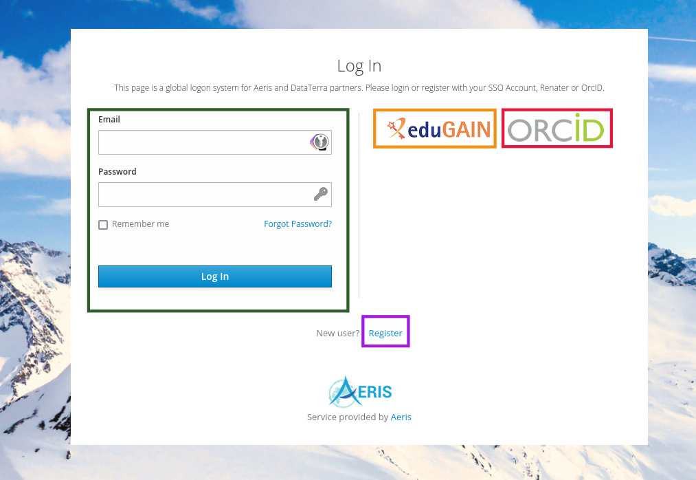

# First connection

## Access the grafana server

1. Go to [https://ccres.ipsl.fr/grafana/](https://ccres.ipsl.fr/grafana/)
1. Click on the `Sign in with AERIS-SSO` button

    {width=500 align=center}

1. You will be redirected on the AERIS-SSO (Single Sign On) login page

## Choose your authentication method

{width=500 align=center}

You have 3 ways to authenticate:
- [edugain](https://edugain.org/)
- [ORCID](https://orcid.org/)
- [AERIS](https://aeris-data.fr)

:::{caution}
You need to **always** use the same method to authenticate on grafana or more generally on CCRES services.
:::

### ORCID (recommended)

ORCID is a service that allows you to use your ORCID credentials to access services. If you choose this method, you will be redirected to the ORCID login page.

{width=500 align=center}

### edugain

Edugain is a service that allows you to use your academic credentials to services. If you choose this method, you will be redirected to your institution's login page.

{width=500 align=center}

### AERIS

If you are unable to use any of the above methods, you can create an AERIS account. Click on the **register** link (purple border).

{width=500 align=center}

You will just have to fill the form and validate your email address.

## After you are authenticated

Once you are authenticated, you will be redirected to the grafana homepage in the `default` organization.
To access to the organization dedicated to `National facilities`, please contact the [support](mailto:ccres-dev@listes.ipsl.fr) to request access.

